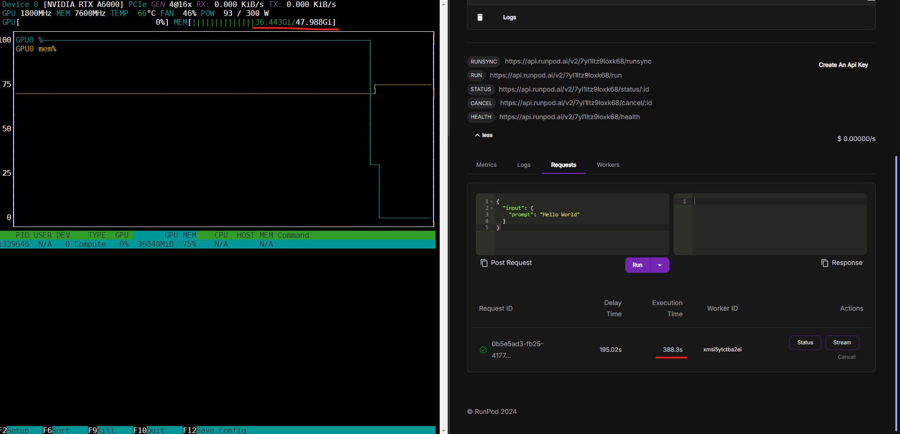

# Runpod Inference serverless API for LoRA Dreambooth on Aurawave

## Key dependencies

#### NVIDIA RTX A6000 or greater

#### Python 3.10 and 3.11

#### Cuda 12.4

## How to run

### Rename .env.example to .env and set up values

### Test on local

```bash
$ sudo nano test_input.json
```

#### Example test data

```
{
  "input": {
    "s3_lora_bucket": "aurawave-users-portraits",
    "s3_lora_object": "Joshua-1731319691495/joshua-lora.safetensors",
    "prompt": "A headshot of an ohwx man in a safety helmet and work gear, showcasing a confident expression, industrial equipment and machinery in the background, head and shoulders composition, ultra-realistic, high detail, 8k resolution, high quality",
    "guidance_scale": 7.5,
    "height": 1024,
    "width": 1024,
    "num_inference_steps": 80
  }
}
```

```bash
$ python index.py
```

### Deploy to runpod

- Build docker image and push to docker hub.

- Set up docker credential on runpod if you pushed to private docker repo.

- Create a new runpod template with your docker repo.

- Enjoy your inference with runpod webhook api.


